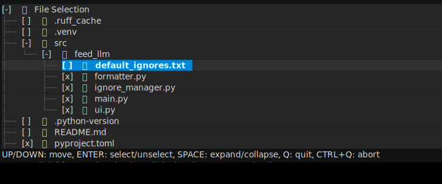

# feed-llm

`feed-llm` is a command-line tool that helps you select files from a directory (using a TUI) and output their contents in either Markdown or XML format. It can copy the resulting formatted text to your clipboard or print it to `stdout`, making it easier to feed code or documents into Large Language Models (LLMs) or other tools.



## Features

- **Interactive File Selection (TUI)**  
  Utilizes [Textual](https://github.com/Textualize/textual) to provide a text-based user interface for browsing directories and selecting files. You can use the mouse or keyboard to navigate.

- **Markdown or XML Formatting**  
  Choose between Markdown or XML output. Binary files are represented with a placeholder instead of actual content.

- **Persistent State**  
  Remembers previously selected files within a given directory, so you can continue where you left off.

- **Clipboard Support**  
  By default, copies the final output to your clipboard (using `pyperclip`), or optionally prints to `stdout`.

## Installation

```shell
# Install with uv (recommended).
uv tool install git+https://github.com/nahco314/feed-llm

# Install with pip.
pip install feed-llm@git+https://github.com/nahco314/feed-llm
```

## Usage

```bash
feed-llm [PATH] [--stdout] [--format <markdown|xml>] [--no-ignore]
```

### CLI Options

- **`[PATH]`**  
  The directory to explore. Defaults to the current directory (`"."`).

- **`--stdout`**  
  If present, prints the final output to standard output instead of copying it to the clipboard.

- **`--format <markdown|xml>`**  
  Specify the output format. Defaults to `"markdown"`.

- **`--no-ignore`**  
  If set, none of the ignore patterns in `default_ignores.txt` or `.feed-llm-ignore` will be applied.

### Navigating the TUI

Once you run `feed-llm`, a text-based UI opens to let you select files:

- **Up/Down**: Move selection
- **Enter**: Select/unselect a file or directory
- **Space**: Expand/collapse a directory
- **q**: Quit normally (saves new state for next time)
- **Ctrl+q**: Abort (no state changes are saved)

You can also use the mouse:
- **Click the `[ ]` area** to toggle selection of an item  
- **Click elsewhere** on a directory to expand or collapse it

When you quit normally, `feed-llm` will either copy your formatted selection to the clipboard or print it to `stdout`, depending on the command-line options.

## Contributing


Contributions, issues, and feature requests are all welcome!

As a matter of fact, most of the code for this project was generated by LLM, so the code style and comments may be a little strange. So even small refactorings and comment fixes are welcome.

## License

License is MIT.
